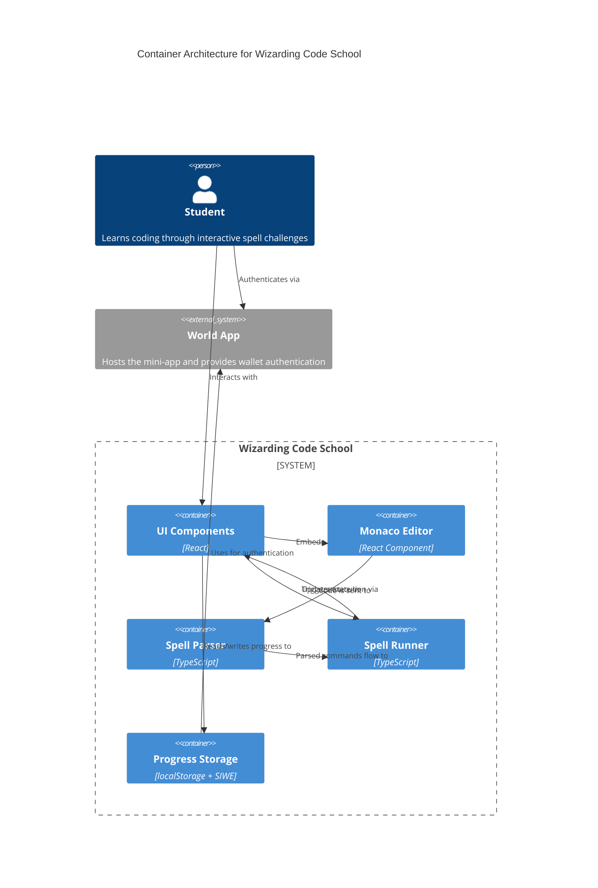

# Architecture Documentation

## Overview

Wizarding Code School is built as a single-page React application with a
component-based architecture. The application functions as an interactive coding
environment where users write "spells" (JavaScript-like code) that are parsed,
executed, and visualized in real-time. State management uses React hooks, with
persistent storage via localStorage leveraging Ethereum wallet addresses as
unique identifiers.

## Container Diagram

## Data Flow

1. **Code Input**: User writes spell code in Monaco Editor component
2. **Parsing**: When "Run" is clicked, EditorPane passes text to Parser module
3. **Command Generation**: Parser converts text to Command[] array
4. **Execution**: Runner executes commands sequentially with timeouts (200ms)
5. **State Updates**: Each step updates player position state in parent component
6. **Rendering**: DungeonView rerenders to show new player position
7. **Completion Check**: After each move, checks for success (reached goal) or failure
   (hit wall)
8. **Feedback**: Displays success/failure feedback and hints when applicable
9. **Progress Storage**: On success, saves level completion to localStorage

## Module Responsibilities

| Module          | Purpose                   | Public API                                       |
| --------------- | ------------------------- | ------------------------------------------------ |
| EditorPane      | Code editing interface    | `<EditorPane code={string} `                     |
|                 |                           | `onChange={(v: string) => void} />`              |
| DungeonView     | Renders maze and player   | `<DungeonView maze={number[][]}`                 |
|                 |                           | `pos={{x: number, y: number}} />`                |
| Parser          | Converts code to commands | `parse(text: string): Command[]`                 |
| Runner          | Executes movement logic   | `run(commands: Command[], initialPos: Position,` |
|                 |                           | `maze: Maze, onStep: Callback,`                  |
|                 |                           | `onEnd: Callback): void`                         |
| WalletAuth      | User authentication       | `useWalletAuth(): {`                             |
|                 |                           | `address: string \| null,`                       |
|                 |                           | `requestAuth: () => Promise<void> }`             |
| ProgressTracker | Saves/loads progress      | `useProgress(address: string): {`                |
|                 |                           | `completed: string[],`                           |
|                 |                           | `saveProgress: (level: string) => void }`        |
| HintSystem      | Provides guidance         | `useHintTimer(hints: string[],`                  |
|                 |                           | `idleMs?: number):`                              |
|                 |                           | `{ currentHint: string \| null }`                |

## Future Work

- **World ID Integration**: Add verifiable human authentication to prevent bot
  usage
- **User-Generated Content**: Allow users to create and share their own dungeons
  and challenges
- **Social Leaderboards**: Compare performance metrics with friends and global
  rankings
- **Advanced Spell Functions**: Expand command set with loops, conditionals, and
  custom functions
- **Mobile Optimization**: Adapt UI for touch-friendly interfaces on smartphones
  and tablets
