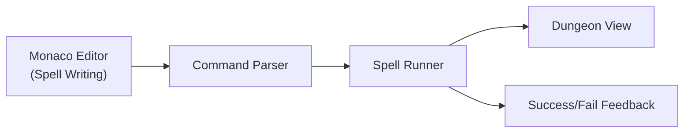

# Wizarding Code School

A gamified coding education mini-app that teaches programming concepts through interactive spell-casting challenges. Students write "spells" (JavaScript code) to navigate through magical dungeons and solve puzzles.

## Why This Exists

Wizarding Code School bridges the gap between traditional coding tutorials and engaging game experiences. Built as a World Mini-App, it demonstrates how educational content can be delivered in an immersive, interactive format.

## Quick Start

```bash
# Install dependencies
pnpm install

# Development server
pnpm dev

# World Mini-App development mode
pnpm world dev

# Package as World Mini-App
pnpm world pack
```

## Architecture



## Glossary

| Term | Definition |
|------|------------|
| Spell | JavaScript-like code snippets that control player movement |
| DungeonView | Grid-based visualization of the maze and player position |
| Runner | Execution engine that processes parsed commands and animates movement |
| SIWE | Sign-In With Ethereum (EIP-4361) - authentication method used for progress tracking |

## Project Structure

```
wizarding-code-school/
├── src/
│   ├── components/      # React components (DungeonView, EditorPane, etc.)
│   ├── hooks/           # React hooks (useWalletAuth, useProgress, etc.)
│   ├── data/            # Maze definitions and hint data
│   ├── utils/           # Parser, runner, and other utilities
│   └── App.tsx          # Main application component
├── world-app.manifest.json  # World Mini-App manifest
└── docs/                # Additional documentation
```

## Contributing

Please see our [CONTRIBUTING.md](./CONTRIBUTING.md) for guidelines on how to contribute to this project.

## License

This project is licensed under the MIT License - see the [LICENSE](./LICENSE) file for details.
